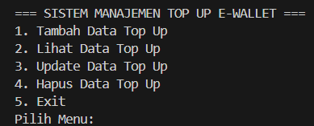
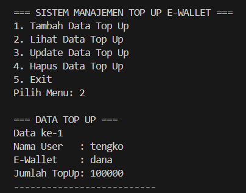

# Sistem Manajemen Top Up E-Wallet

## Deskripsi Program
Program ini merupakan aplikasi sederhana berbasis Java yang digunakan untuk mengelola data top up E-Wallet. 
Program dibuat menggunakan konsep Object Oriented Programming (OOP) dengan memanfaatkan class, object, method, dan constructor.

Data disimpan menggunakan ArrayList sehingga pengguna dapat melakukan operasi CRUD (Create, Read, Update, Delete).

## Fitur Program
Program memiliki beberapa fitur utama yaitu:
- Menambahkan data top up E-Wallet
- Menampilkan data top up
- Mengubah data top up
- Menghapus data top up
- Menu program berjalan berulang sampai memilih exit

## Struktur Program

Program terdiri dari dua class utama:

### 1. App.java
Berfungsi sebagai program utama yang berisi menu dan pengolahan data CRUD.

### 2. EWallet.java
Berfungsi sebagai class yang menyimpan data:
- Nama User
- Jenis E-Wallet
- Jumlah Top Up

## Konsep OOP yang Digunakan
Program ini menggunakan beberapa konsep dasar OOP yaitu:

- **Class**
  Digunakan untuk membuat blueprint data EWallet.

- **Object**
  Digunakan untuk membuat instance dari class EWallet.

- **Constructor**
  Digunakan untuk memberikan nilai awal pada objek saat dibuat.

- **Method**
  Digunakan untuk menampilkan data top up.

## Screenshot Program

### Tampilan Menu

### Tampilan Data

## Kesimpulan
Program Sistem Manajemen Top Up E-Wallet dapat digunakan untuk mengelola data top up secara sederhana menggunakan konsep pemrograman berorientasi objek di Java.