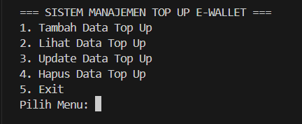

# POSTTEST 2 – Pemrograman Berorientasi Objek (PBO)

## Deskripsi Program

Program ini merupakan sistem sederhana untuk **mengelola data Top Up E-Wallet** menggunakan bahasa pemrograman **Java**.
Program dibuat dengan konsep **Object Oriented Programming (OOP)** dan merupakan pengembangan dari Posttest sebelumnya dengan menerapkan **Encapsulation**, **Getter**, **Setter**, serta **Access Modifier**.

Program berjalan pada **console/terminal** dan menyediakan fitur untuk mengelola data transaksi top up pengguna.

---

## Fitur Program

Program memiliki beberapa fitur utama:

1. **Tambah Data Top Up**
2. **Lihat Data Top Up**
3. **Update Data Top Up**
4. **Hapus Data Top Up**
5. **Keluar dari Program**

Semua data top up disimpan sementara menggunakan **ArrayList** selama program berjalan.

---

## Konsep OOP yang Digunakan

### 1. Class

Program memiliki dua class utama:

* `App` → sebagai class utama yang menjalankan program
* `EWallet` → class yang merepresentasikan objek data top up

### 2. Object

Object dibuat dari class `EWallet` ketika data top up baru dimasukkan.

Contoh:

```
EWallet data = new EWallet(nama, wallet, jumlah);
```

### 3. Encapsulation

Encapsulation diterapkan dengan membuat atribut pada class `EWallet` bersifat **private** sehingga tidak dapat diakses secara langsung dari luar class.

Contoh:

```
private String namaUser;
private String jenisWallet;
private int jumlahTopUp;
```

### 4. Getter

Getter digunakan untuk mengambil nilai dari atribut.

Contoh method getter:

```
getNamaUser()
getJenisWallet()
getJumlahTopUp()
```

### 5. Setter

Setter digunakan untuk mengubah nilai atribut.

Contoh method setter:

```
setNamaUser()
setJenisWallet()
setJumlahTopUp()
```

Setter juga digunakan untuk melakukan **validasi data**, misalnya memastikan jumlah top up tidak bernilai negatif.

### 6. Access Modifier

Program menggunakan beberapa access modifier:

* **private** → untuk atribut pada class `EWallet`
* **public** → untuk constructor dan method getter/setter

Hal ini bertujuan untuk menjaga keamanan data pada objek.

---

Penjelasan:

* **App.java**
  Berisi program utama yang menjalankan menu dan mengelola data.

* **EWallet.java**
  Berisi class yang merepresentasikan data top up E-Wallet beserta atribut dan methodnya.

---

## Cara Menjalankan Program

### 1. Compile Program

Buka terminal pada folder project kemudian jalankan:

```
javac App.java
```

### 2. Jalankan Program

```
java App
```

Program akan menampilkan menu sistem manajemen top up e-wallet pada terminal.

---

## Contoh Tampilan Program


## Kesimpulan

Program ini menunjukkan penerapan konsep dasar **Pemrograman Berorientasi Objek (PBO)** pada Java dengan memanfaatkan:

* Class dan Object
* Encapsulation
* Getter dan Setter
* Access Modifier

Program ini dapat dikembangkan lebih lanjut dengan menambahkan fitur seperti penyimpanan database, validasi input yang lebih kompleks, atau antarmuka grafis.
